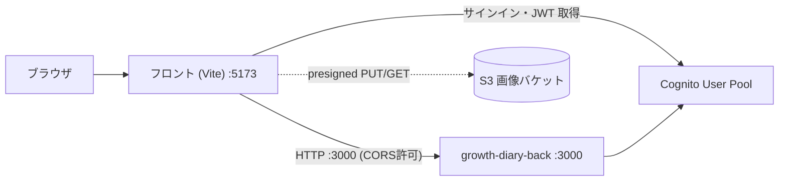
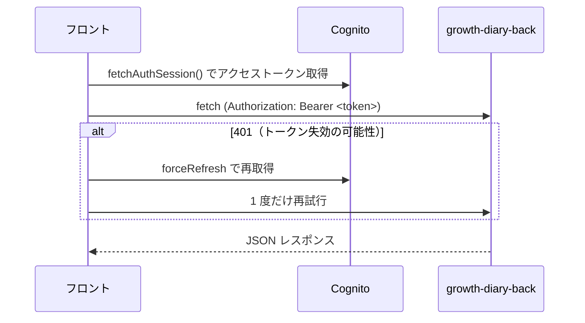

# growth-diary-front

子供の成長日記アプリ（離乳食・アレルギー・予防接種・成長・アルバム等）のフロントエンド。Vite + React + TypeScript の SPA で、API は [growth-diary-back](https://github.com/atsushi59/growth-diary-back)（Fastify on Lambda）、認証は Amazon Cognito、画像は S3 へ署名付き URL で直接アップロードする。

## 技術スタック

| 分類 | 採用 |
|---|---|
| 言語 / ランタイム | TypeScript ~6 / Node.js 22 |
| ビルドツール | Vite 8（`@vitejs/plugin-react`） |
| UI ライブラリ | React 19（React Compiler 前提の lint ルール） |
| ルーティング | React Router 8（Declarative モード） |
| スタイリング | Tailwind CSS v4（`@tailwindcss/vite` プラグイン） |
| グラフ | Recharts 3（発育曲線グラフ） |
| バリアント管理 | class-variance-authority（UI コンポーネントの variant） |
| 認証 | Amazon Cognito（`aws-amplify` の Auth） |
| Lint | ESLint（typescript-eslint / react-hooks / react-refresh） |

- `tailwind.config.js` / `postcss.config.js` は**使わない**。色などの設定は `src/index.css` の `@theme` に集約する（Tailwind v4 構成）。
- create-react-app は使わない。Vite + React + TypeScript 構成。

## アーキテクチャ構成図

### ローカル開発



- フロントは `VITE_API_BASE_URL`（既定 `http://localhost:3000`）へリクエストする。
- ログイン/サインアップは Cognito（`aws-amplify`）で行い、取得したアクセストークンを API リクエストの `Authorization: Bearer` に付与する。
- 画像はバックから署名付き URL を受け取り、**S3 へ直接** PUT/GET する（バックを経由しない）。

### リクエストの流れ（認証付き API 呼び出し）



- 上記は [`src/lib/api.ts`](src/lib/api.ts) の `apiRequest` に集約。ベース URL 付与・トークン付与・401 リトライ・非2xx の例外化を一元化している。

## ルーティング / レイアウト方針

React Router v8 の **Declarative モード**（`<BrowserRouter>` + `<Routes>`/`<Route>`、定義は [`src/main.tsx`](src/main.tsx)）。

- **メニューボタンの有無は path 分岐ではなくレイアウトで分ける。**
  - `AuthLayout`（メニューなし・認証不要）… `/login` `/signup`
  - `AppLayout`（右下フローティングメニューあり・ログイン後）… `/children` `/growth` `/albums` `/allergies` `/foods` `/vaccinations` `/consultation` `/mypage`
  - 各ページは `<Outlet />` で描画する。
- 検証用ページ（`/list`：各ページへのリンク一覧、`/debug`：実行環境情報、`/upload-test`：画像アップロード検証）は、メニュー不要なのでどのレイアウトにも属さないトップレベルルート。
- 未マッチ（`path="*"`）は `NotFound`。

> 実装状況: 認証（ログイン/サインアップ）・こども（CRUD・画像）・成長記録（グラフ表示／年単位の入力モーダル）が実装済み。その他ページは画面遷移の骨組み。

## カラーシステム（厳守）

色は**役割ベース（セマンティック）のクラスだけ**で指定する。メインカラーは **#0A6E9E（青寄りティール）**。定義は [`src/index.css`](src/index.css) の `@theme` ブロックに集約する。

- 使ってよい例: `bg-primary` / `text-foreground` / `border-border` / `bg-destructive` など役割名クラス。
- **禁止**: 生の色コード（`bg-[#0A6E9E]`）、Tailwind 標準色（`bg-blue-500` 等。`--color-*: initial` で無効化済み）、インライン `style` での色指定。
- 新しい色が必要なら、まず役割名で `@theme` に追加してからクラスとして使う。

| 役割名 | 用途 |
|---|---|
| `primary` / `primary-50` / `primary-700` / `primary-foreground` | 主要アクション・薄い背景・濃い文字/枠線・primary 上の文字 |
| `surface` / `subtle` / `muted` / `accent` | 背景（基準・控えめ・抑え・hover） |
| `foreground` / `muted-foreground` / `subtle-foreground` | 文字（基準・抑え・補足） |
| `border` / `input` / `ring` | ボーダー・フォーム枠・フォーカスリング |
| `destructive` / `success` / `warning` | 機能色（削除・成功・警告） |

## ディレクトリ構成

```
src/
├── main.tsx              ← エントリポイント。ルーティング定義
├── index.css            ← Tailwind 読み込み + @theme でカラー定義
├── lib/
│   ├── api.ts           ← API ラッパー（ベースURL・トークン付与・401リトライ）
│   ├── amplify.ts       ← Cognito 接続設定（起動時に Amplify.configure）
│   ├── children.ts      ← こども API
│   ├── growth.ts        ← 成長記録 API・発育曲線マスタ・月齢計算
│   └── upload.ts        ← S3 署名付き URL 経由の画像アップロード
├── contexts/            ← 選択中のこども（SelectedChildProvider）
├── layouts/             ← AuthLayout / AppLayout
├── components/
│   ├── ui/              ← 汎用 UI（Button / Input / Select / Modal / ImageUploader）
│   └── ...              ← 機能コンポーネント（GrowthChart / 各種 Modal 等）
└── pages/               ← 各画面（1 ファイル 1 コンポーネント）
```

## ローカル開発のセットアップ

前提: Node.js 22 以上。API は [growth-diary-back](https://github.com/atsushi59/growth-diary-back) をローカル（`http://localhost:3000`）で起動しておく。

```bash
# 1. 依存をインストール
npm install

# 2. 環境変数を用意（.env.example をコピーして値を設定）
cp .env.example .env

# 3. 開発サーバー起動（http://localhost:5173/）
npm run dev
```

### 環境変数（`.env`）

Vite は `VITE_` 接頭辞の変数だけをフロントに公開する。未設定だと起動時に例外を投げて早期に気づけるようにしている。

| 変数 | 用途 |
|---|---|
| `VITE_API_BASE_URL` | バック API のベース URL（ローカル既定 `http://localhost:3000`） |
| `VITE_COGNITO_USER_POOL_ID` | Cognito User Pool ID（region は ID から導出されるため不要） |
| `VITE_COGNITO_USER_POOL_CLIENT_ID` | Cognito User Pool Client ID |

### スクリプト

| コマンド | 内容 |
|---|---|
| `npm run dev` | 開発サーバー起動（http://localhost:5173/） |
| `npm run build` | 型チェック（`tsc -b`）+ 本番ビルド（`vite build`） |
| `npm run lint` | ESLint |
| `npm run preview` | 本番ビルドのプレビュー |

## 認証フロー

- 起動時に [`src/lib/amplify.ts`](src/lib/amplify.ts) が `Amplify.configure` で Cognito を設定する。
- ログイン/サインアップは `aws-amplify/auth` の API で行う。
- API 呼び出しは `apiRequest` が `fetchAuthSession()` でアクセストークンを取得して `Authorization` に付与する。未ログイン時はトークン無しで素通り、401 時はトークンを強制リフレッシュして 1 度だけ再試行する。

## 画像アップロードフロー

[`src/lib/upload.ts`](src/lib/upload.ts) の `uploadImage` が以下を行う（バックの署名付き URL 契約に準拠）。

1. フロントで MIME（JPEG / PNG / WebP）とサイズ（5MB 以下）を事前バリデーション。
2. `POST /uploads/image-url` で署名付き PUT URL と S3 キーを取得。
3. その URL へ **S3 へ直接** PUT（`Content-Type` は発行時の `contentType` と一致させる）。
4. 返ってきた S3 キーを対象リソース（例: こども）に保存する。

## 注意

- `.env` は認証情報・接続先を含むため push しない（`.env.example` のみ共有）。
- ビルド成果物（`dist/`）は再生成可能なためコミットしない。
- 色は役割名クラスのみ。生の色コード・Tailwind 標準色・インライン `style` での色指定は使わない（[`src/index.css`](src/index.css) 参照）。
